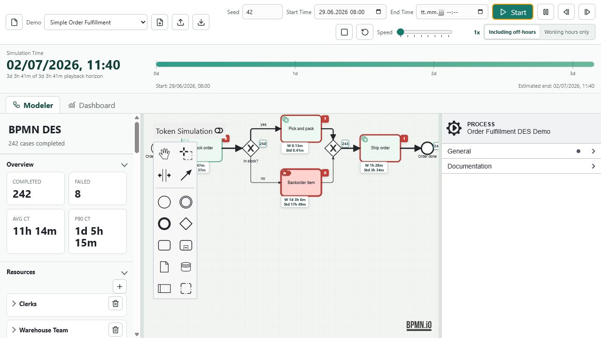
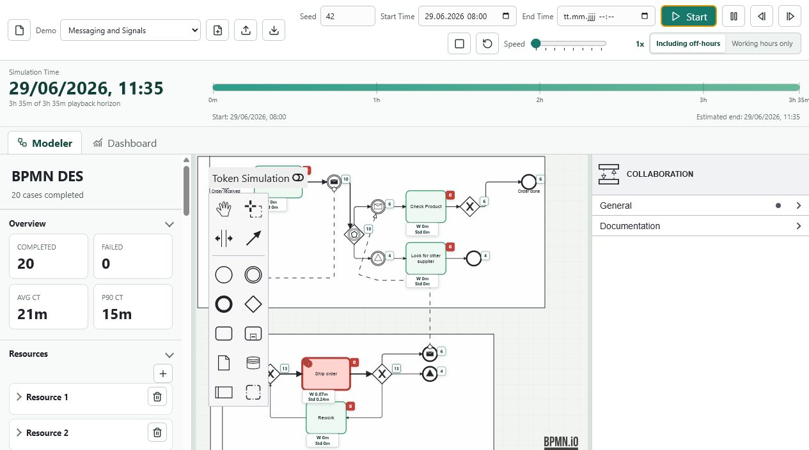
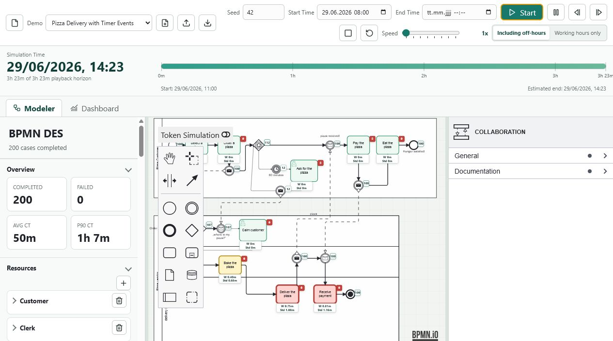
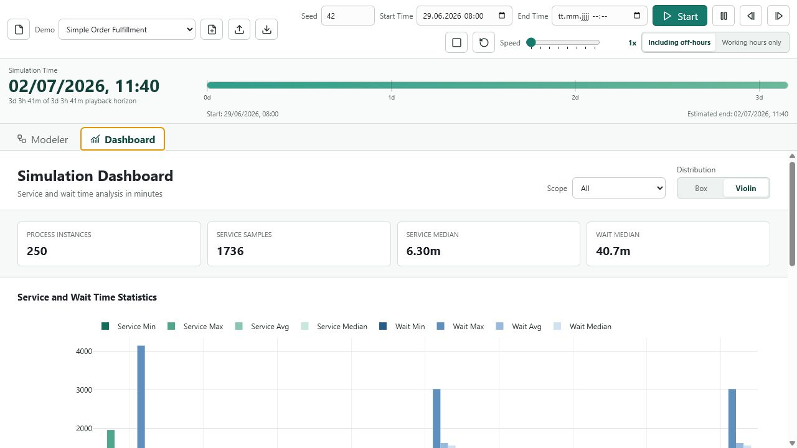

# BPMN DES Simulator User Guide

Dieser Leitfaden beschreibt die Bedienung des BPMN DES Simulators aus fachlicher Sicht. Er richtet sich an Prozessmanagement- und BPMN-Experten; BPMN-Grundlagen, einfache JavaScript-Ausdruecke und statistische Kennzahlen werden vorausgesetzt.

Der Simulator fuehrt BPMN-Modelle nicht operativ aus. Service Tasks, User Tasks, Script Tasks und weitere Activities werden stochastisch modelliert: Dauer, Ressourcenbelegung, Fehler und Output-Variablen werden simuliert und als diskrete Ereignisse in einer Timeline abgelegt.

## Grundidee

Die Simulation besteht aus zwei getrennten Schritten:

1. Die DES-Engine berechnet einen vollstaendigen geordneten Event Log.
2. Das Playback rekonstruiert daraus zu jeder Playback-Zeit den visuellen Zustand im BPMN-Diagramm.

Die Visualisierung ist damit ein Replay der berechneten Timeline. Sie steuert die DES-Engine nicht direkt und fuehrt keine fachlichen Aktionen aus.

## Oberflaeche

Die Anwendung besteht aus:

- Toolbar mit Demo-Auswahl, Import/Export, Seed, Start Time, optionaler End Time, Run Controls und Speed.
- Zeitfortschrittsleiste mit aktueller Simulationszeit und geschaetztem Zeithorizont.
- Linke Sidebar mit Uebersicht, Ressourcen, Bottlenecks, Pfaden, Statistik, Event Log, Warnungen und Export.
- Zentralem BPMN Modeler.
- Rechtem Properties Panel fuer BPMN- und Simulationsparameter.
- Separatem `Performance`-Tab fuer Service-/Wartezeitdiagramme.
- Separatem `Process Flow`-Tab fuer Event-Log-Analysen und Process-Data-Science-Visualisierungen.
- `Import Event Log` in der Toolbar fuer externe CSV-, JSON-, XES- oder MXML-Logs.



## Simulation Starten

1. Demo-Modell waehlen oder BPMN importieren.
2. Simulationsparameter im Properties Panel pruefen oder anpassen.
3. Optional `Seed` setzen, um reproduzierbare Zufallszahlen zu erhalten.
4. Optional `Start Time` setzen. Der Default ist der naechste Montag um 08:00 Uhr.
5. Optional `End Time` setzen, wenn die Simulation hart an diesem Zeitpunkt abbrechen soll.
6. `Start` ausloesen.

Wichtig: Die angezeigte `Estimated end` in der Zeitfortschrittsleiste ist nur ein visueller Planungswert aus den Arrival-Daten der Start Events plus 20 Prozent Puffer. Die Simulation bricht dadurch nicht ab. Ein Abbruch erfolgt nur, wenn der Benutzer explizit ein `End Time`-Feld befuellt.

Wenn der Token-Simulation-Schalter im Diagramm aktiv ist, erzeugt `Start` zuerst den DES-Lauf und spielt danach die Timeline im Diagramm ab. `Pause`, `Step backward`, `Step forward`, `Stop` und `Reset` steuern dann das Playback.

## Simulationszeit

Die interne DES-Zeit wird in Stunden gerechnet. Eingaben fuer Dauern und Arrival-Intervalle erfolgen in Minuten. Die Anzeige formatiert groessere Werte automatisch, z. B. `4h 5m` oder `3d 2h`.

Die Zeitfortschrittsleiste zeigt:

- aktuelle Simulationszeit als Datum/Uhrzeit,
- Startpunkt des Replay-Horizonts,
- geschaetztes oder explizites Ende,
- Ticks in Stunden oder Tagen, abhaengig von der Gesamtdauer.

## Start Events

Start Events definieren, wie Prozessinstanzen erzeugt werden.

Arrival Distribution:

- `None`: erzeugt keine Tokens. Das ist fuer Message- oder Signal-Start-Events relevant.
- `Fixed`: konstantes Interarrival-Intervall in Minuten.
- `Normal`: normalverteiltes Interarrival-Intervall.
- `Exponential`: exponentialverteiltes Interarrival-Intervall.

Weitere Parameter:

- `Number of cases`: Anzahl zu erzeugender Instanzen fuer dieses Start Event.
- Arrival Calendar: Wochentage und stundenweise Zeitfenster, in denen neue Instanzen eintreten duerfen.

Bei Message- und Signal-Start-Events werden Arrival-Einstellungen ignoriert, wenn das Start Event korreliert durch eine eingehende Message oder ein Signal gestartet wird.

## Activities

Activities besitzen eine Duration Distribution:

- `Fixed`
- `Uniform`
- `Normal`
- `Exponential`
- `Triangular`

Die jeweils relevanten Parameter werden im Properties Panel dynamisch angezeigt. Alle Werte werden in Minuten eingegeben; Float-Werte sind erlaubt, z. B. `0.1` fuer 6 Sekunden.

Optional kann eine Ressource zugewiesen werden. Ressourcen werden nicht als Freitext eingegeben, sondern aus dem globalen Resource Catalog ausgewaehlt.

Activities koennen Output Objects erzeugen. Output Objects sind flache Key-Value-Listen mit den Typen:

- `Int`
- `Float`
- `String`

Numerische Felder koennen feste Werte, Random Choice oder Verteilungen verwenden. Strings koennen fest, zufaellig oder kategorial erzeugt werden. Die erzeugten Variablen werden in der Prozessinstanz gespeichert und koennen spaeter in Gateway-Conditions verwendet werden.

## Ressourcen

Ressourcen werden in der linken Sidebar gepflegt. Jede Ressource hat:

- ID
- Name
- Capacity
- Working Days
- Working Hours in Stundenbloecken

Die Kalender werden in der Simulation verwendet. Warte- und Bearbeitungszeiten koennen sowohl inklusive als auch exklusive Off-Timetable Hours ausgewertet werden. Der Umschalter `Including off-hours` / `Working hours only` wirkt auf Sidebar, Performance-Tab und Heatmap.

## Gateways und Sequence Flows

Exclusive Gateways verwenden folgende Prioritaet:

1. Wenn ausgehende Sequence Flows Conditions haben, werden diese ausgewertet.
2. Wenn keine Condition wahr ist, wird der Default Flow verwendet.
3. Wenn kein Default Flow existiert, wird eine Warnung erzeugt.
4. Wenn keine Conditions existieren, werden Branch Probabilities verwendet.
5. Fehlende Wahrscheinlichkeiten werden gleichverteilt behandelt und als Warnung geloggt.
6. Wahrscheinlichkeiten mit Summe ungleich 1 werden normalisiert.

Conditions werden als einfache JavaScript-Ausdruecke hinterlegt, z. B.:

```js
priority >= 2
outputs.Task_Check_Order.reviewerNote === "manual_check"
```

Parallel Gateways werden fuer Split und Join unterstuetzt. Event-Based Gateways registrieren konkurrierende Message-, Signal- oder Timer-Catch-Events. Das zuerst eintretende Event gewinnt, die anderen Alternativen werden storniert.

## Messages, Signals und Timer

Collaborations mit mehreren Pools werden als mehrere BPMN-Prozesse simuliert. Message Flows korrelieren Prozessinstanzen ueber Parent/Child-Beziehungen. Child-Prozesse erhalten `parentCaseId` als Prozessvariable.

Unterstuetzt werden:

- Message Start Events
- Message Intermediate Catch/Throw Events
- Message End Events
- Signal Start Events
- Signal Intermediate Catch/Throw Events
- Signal End Events
- Timer Intermediate Catch Events
- Event-Based Gateways mit Message-, Signal- oder Timer-Kandidaten

Timer unterstuetzen BPMN Time Durations und duration-basierte Time Cycles, z. B.:

```text
PT60M
P14D
R3/PT60M
```

Absolute Datumsangaben und Monate/Jahre werden nicht simuliert.



## Subprozesse und Fehler

Eine eingebettete Sub-Process Activity startet eine eigene korrelierte Child-Instanz. Prozessvariablen des Parents werden an den Child weitergegeben. Beim normalen Ende werden aktualisierte Variablen an den Parent zurueckgegeben.

Activities koennen BPMN Error Events werfen. Boundary Error Events an Activities oder Subprozessen koennen diese Fehler auffangen, wenn der Error Type passt. Ohne passenden Boundary Handler wird die Instanz als fehlgeschlagen abgeschlossen.

Terminate End Events beenden die betroffene Prozessinstanz und entfernen alle aktiven Tokens dieser Instanz, inklusive wartender Message-/Signal-Catch-Tokens.

## Token Playback und Overlays

Wenn Token Playback aktiv ist, werden Tokens als Overlays im Diagramm angezeigt:

- Einzelne Tokens zeigen die CaseID.
- Zusammengefasste Tokens zeigen die Anzahl.
- Aktive Activities werden hervorgehoben.
- Task-Boxen zeigen laufend aktualisierte Wartezeitstatistiken und Fehlerzaehler.
- Events und Gateways zeigen kleine Ausfuehrungszaehler.
- Kantenstaerken werden relativ zur Casezahl skaliert.
- Activity-Farben zeigen Wartezeitintensitaeten.

Das Playback verwendet eine gemeinsame Uhr. Parallele Bewegungen mit gleicher Simulationszeit werden in atomare Frames gruppiert und synchron angezeigt.



## Statistik in der Sidebar

Die linke Sidebar zeigt:

- Completed und Failed Cases
- Average Cycle Time und P90 Cycle Time
- Bottlenecks nach Warte- und Servicezeiten
- Path Counts und Wahrscheinlichkeiten
- Statistik fuer den ausgewaehlten Task
- Prozessstatistik, wenn kein Task ausgewaehlt ist
- Ressourcenstatistik inklusive Utilization
- Event Log und Warnungen

Die Task-Statistik umfasst:

- Anzahl Ausfuehrungen
- Service Time: Min, Max, Avg, Median
- Waiting Time: Min, Max, Avg, Median
- Fehleranzahl
- Output-Variablen

## Performance

Der `Performance`-Tab zeigt Service- und Wartezeiten fuer:

- jeden BPMN-Prozess bzw. eingebetteten Subprozess,
- jeden Task,
- jede Ressource.

Korrelierte Haupt- und Child-Prozesse werden bewusst getrennt ausgewertet. Die Prozess-Wartezeit ist die Summe der Task-Wartezeiten pro Prozessinstanz.

Die Performance-Ansicht enthaelt:

- gruppierte Balkendiagramme fuer Min, Max, Avg und Median,
- Violin-Plots als Default,
- optional Box-Plots,
- Scope-Filter fuer All, Process, Tasks und Resources.
- Full-screen-Buttons pro Visualisierung.

Wenn ein externes Event Log geladen wurde, nutzt der `Performance`-Tab dieses Event Log als Datenquelle. Service Time wird aus Start- und Endzeit berechnet; Waiting Time wird als Zeitluecke zwischen direkt aufeinanderfolgenden Aktivitaeten derselben Prozessinstanz interpretiert.



## Process Flow

Der `Process Flow`-Tab nutzt Event-Log-Daten. Wenn kein externes Log geladen ist, wird nach einem Simulationslauf das DES-Event-Log der Simulation verwendet. Mit `Import Event Log` kann ein externes Log geladen werden; es muss nicht zum aktuell geladenen BPMN-Modell passen.

Instant-Events ohne Dauer werden standardmaessig ausgeblendet. Als Event ohne Dauer gilt ein Log-Eintrag ohne Endzeit oder mit identischer Start- und Endzeit. Mit `Include events without duration` koennen diese Eintraege fuer alle Process-Flow-Visualisierungen gemeinsam wieder eingeblendet werden.

Unterstuetzt werden:

- CSV mit Semikolon, Komma oder Tab als Trennzeichen.
- Das native `Event Log CSV` des Simulators.
- JSON-Arrays mit Event-Records.
- Vollstaendige `SimulationResult`-JSON-Exporte; daraus wird das Event Log extrahiert.
- XES-Logs mit `trace`, `event`, `concept:name`, `time:timestamp`, optional `lifecycle:transition` und `org:resource`.
- MXML-Logs mit `ProcessInstance` und `AuditTrailEntry`.

Erwartete Spalten bzw. Felder sind Case-ID, Aktivitaetsname, Startzeit, optional Endzeit, optional Ressource und optional Variablen als JSON-String. Typische Process-Mining-Namen wie `case:concept:name`, `concept:name`, `time:timestamp` und `org:resource` werden ebenfalls erkannt.

Bei CSV- und JSON-Dateien wird vor dem Import ein Mapping-Dialog angezeigt. Dort werden die Quellfelder auf das interne Event-Log-Modell gemappt: Case ID, Activity ID, Activity Name, Start Time, End Time, Resource, Process ID und Variables JSON. Der Simulator schlaegt ein Mapping anhand gaengiger Feldnamen vor, das vor dem Import angepasst werden kann.

Die Process-Flow-Ansicht enthaelt:

- Gantt-Chart der Aktivitaeten pro Prozessinstanz.
- Gantt-Chart der Aktivitaeten pro Ressource.
- Resource-Activity-Matrix als Heatmap.
- Resource Graph fuer direkte Ressourcenuebergaenge.
- Resource Transition Matrix als Heatmap.
- Directly-Follows Activity Graph.
- Activity Transition Matrix als Heatmap.
- Full-screen-Buttons pro Visualisierung.

Eine Resource-Verbindung `X -> Y` entsteht, wenn innerhalb derselben Prozessinstanz eine Aktivitaet von Ressource `X` unmittelbar vor einer Aktivitaet von Ressource `Y` liegt. Eine Activity-Verbindung `A -> B` entsteht analog fuer direkt aufeinanderfolgende Aktivitaeten.

## Exporte

Die Exporte nutzen Semikolon als CSV-Trennzeichen.

Verfuegbar sind:

- `Full Simulation Log JSON`: vollstaendiges SimulationResult inklusive Timeline.
- `Simulation Results CSV`: Kennzahlen fuer Prozesse, Tasks und Ressourcen.
- `Event Log CSV`: CaseID, Task/Event-ID, Name, Startzeit, Endzeit, Ressource und Prozessvariablen.

Das Event Log CSV enthaelt die aktuellen Output-Object-Werte der Prozessinstanz als JSON-String.

## Demo-Modelle

Die Demo-Auswahl laedt BPMN-Dateien aus `tests/bpmn`:

- `Simple Order Fulfillment`: ein kompakter Order-Prozess mit Ressourcen, XOR, Task-Dauern, Outputs und Fehlerwahrscheinlichkeiten.
- `Messaging and Signals`: zwei Prozesse/Pools mit Message-/Signal-Korrelation und Event-Based Gateway.
- `Order Fulfillment with Subprocess Errors`: eingebetteter Subprozess mit Boundary Error Events.
- `Pizza Delivery with Timer Events`: zwei Pools, Message-Korrelation, Timer `PT60M`, Terminate End Event und korrelierte Antwortnachrichten.
- `Insurance Claims (QBP Import)`: Beispiel fuer den Import von BIMP/QBP-Simulationsdaten.

## Grenzen der aktuellen Version

Vorbereitet, aber noch nicht vollstaendig implementiert:

- Event Subprocesses
- Message/Signal Boundary Events
- Inclusive Gateways
- Multi-Instance Activities

Nicht unterstuetzte Elemente brechen die Simulation nicht ab. Sie werden transparent behandelt, erzeugen Warnungen und werden im Diagramm markiert.
